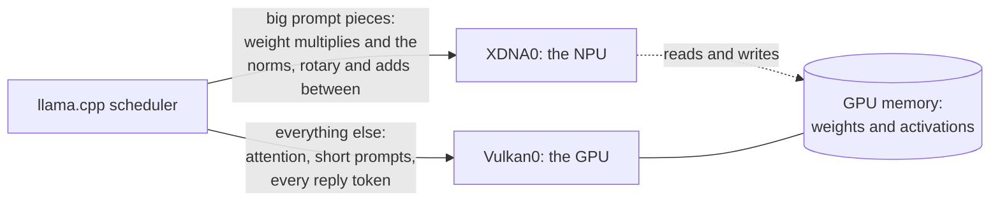

# ggml-xdna: llama.cpp prompt reading on the AMD Ryzen AI NPU

ggml-xdna is an add-on for llama.cpp that reads prompts on the NPU of an
AMD Ryzen AI 300 laptop, next to the integrated GPU. It loads into an
unmodified llama.cpp Windows build. The GPU keeps doing everything else,
including writing the reply.

## Requirements

- Windows 11
- A Ryzen AI processor with an NPU. Only tested on Strix Point: the Ryzen AI
  9 HX 370 with Radeon 890M graphics. At start the add-on runs a small test
  multiply on the NPU and turns on only if it gets it right, so it decides
  by what the NPU does, not by the chip's name (see
  [Troubleshooting](#troubleshooting) if it turns itself off). Strix Halo
  (Ryzen AI Max) and Krackan Point (Ryzen AI 7 350, Ryzen AI 5 340) have the
  same NPU as Strix Point and should pass, but nobody has run it on one
  yet. Strix Halo's GPU is much bigger, so there the GPU may be faster on
  its own.
- The AMD NPU driver. Tested with 32.0.20102.3930.
- A GPU driver with Vulkan. Tested with Radeon driver 32.0.31041.1004.
- llama.cpp release **b10944**, Windows Vulkan build
  (`llama-b10944-bin-win-vulkan-x64.zip`). The add-on is built against that
  release and must run with it.

## Quick start

There's no release zip yet. [Build from source](#building-from-source):
`build.cmd` downloads llama.cpp b10944 into `third_party\llama-b10944` and
puts the add-on (`ggml-xdna.dll`), the NPU kernel (`bfp16_gemm.xclbin`) and
the launcher (`npu.exe`) next to it.

From that folder, put `npu` in front of the llama.cpp command:

```
npu llama-server
npu llama-cli -m model.gguf
```

With no model given, `npu` lists the models it finds and asks which one:

```
Models found:
   0  all of them: llama-server's router, which loads each model when it's asked for
   1  granite-4.1-3b-Q4_K_S                 2.0 GB  LM Studio: unsloth
   2  Qwen3.8-27B-UD-IQ3_S                 12.0 GB  LM Studio: unsloth
   3  gpt-oss-20b-MXFP4                    12.1 GB  Hugging Face: ggml-org
Pick a number (Enter: granite-4.1-3b-Q4_K_S; q: quit):
```

It looks in a `models` folder next to `npu.exe`, LM Studio's models folder,
llama.cpp's download folder and the Hugging Face download folder. Enter
picks the model you chose last time. "All of them" (llama-server only)
serves every model in the list and loads each when a request names it.

What `npu` does for you:
- points llama.cpp at the add-on next to it;
- checks the NPU can run, and if so adds `-dev XDNA0,Vulkan0`. If it can't,
  it adds nothing, says why in one line, and llama.cpp runs on the GPU;
- adds `-ub 2048 -b 2048` for llama-server, llama-cli and llama-completion
  when the NPU is on, so prompts reach it in bigger pieces (faster, see
  below). You can pass `-ub 512` to keep llama.cpp's default, but then the
  NPU sits out unless you also pass `--min-chunk 512` (below).

Anything you give yourself (`-m`, `-dev`, `-ub`, `-b`) is kept, and the
rest of your command reaches llama.cpp exactly as typed. `npu server` works
for `npu llama-server` too. Put the folder on your `PATH` to run `npu` from
anywhere.

`npu`'s own options go before the program's name:

```
npu --memory-gb 20 llama-server -m model.gguf
```

`--memory-gb` is the most memory the NPU's copies of the weights may take,
in GB (`0.5` works; `0` keeps the NPU out). Without it, the limit is the
memory free once the model is loaded, less 4 GB or a tenth of the machine's
memory, whichever is larger. Layers that don't fit stay on the GPU.

`--min-chunk` is the smallest piece of a prompt, in tokens, the NPU takes.
The default is 1,024: smaller pieces go to the GPU, which read them faster
in our tests. `npu --min-chunk 512 llama-bench ...` puts llama.cpp's
default 512-token chunks on the NPU too.

`npu -h` lists the options.

**Without the launcher,** set `GGML_BACKEND_PATH` to the add-on and name
the NPU yourself:

```
set GGML_BACKEND_PATH=C:\path\to\llama-b10944\ggml-xdna.dll
llama-server -m model.gguf -dev XDNA0,Vulkan0
```

Without `-dev XDNA0,...`, llama.cpp runs as if the add-on weren't there.

## The NPU's power mode

The NPU has a power setting of its own, separate from Windows'. AMD
recommends "Performance" for language models. In our tests it made no
clear difference: in one pair of runs the add-on read Qwen3-1.7B's prompts
about 10% faster with it, and in another no faster (see
[Results](#results)).

To change it, open a terminal as administrator (Start, type `cmd`, then
"Run as administrator") and run:

```
C:\Windows\System32\AMD\xrt-smi.exe configure --pmode performance
```

`xrt-smi` comes with the NPU driver. It isn't on the `PATH`, so give its
full path. To check the setting:

```
C:\Windows\System32\AMD\xrt-smi.exe examine -r platform
```

It shows `Power Mode : Performance`. To go back:

```
C:\Windows\System32\AMD\xrt-smi.exe configure --pmode default
```

- It applies to everything that uses the NPU, not just llama.cpp, and it
  uses more power. We haven't measured how much.
- In our tests it went back to "Default" after a restart, so check it with
  the `examine` command after restarting.
- `--pmode turbo` also exists. It needs the charger plugged in (otherwise it
  acts as `performance`). We haven't measured it.

## Results

Prompt reading speed with the add-on, against the GPU alone, both reading
in 2,048-token chunks (what `npu` uses). Ryzen AI 9 HX 370, measured
2026-10-02. Each figure is the median of paired runs; the slowest and
fastest runs are in brackets.

| model | prompt tokens | NPU power mode "Default" | "Performance" |
|---|---|---|---|
| Qwen3-1.7B Q4_0 | 1,024 | 1.04x (0.96–1.24x) | 1.00x (0.94–1.05x) |
| Qwen3-1.7B Q4_0 | 2,048 | 1.04x (0.94–1.19x) | 0.99x (0.90–1.27x) |
| Qwen3-1.7B Q4_0 | 4,096 | 1.03x (0.93–1.16x) | 0.96x (0.94–1.11x) |
| Qwen3-4B Q4_K_M | 2,048 | 1.32x (1.13–1.50x) | 1.33x (1.22–1.46x) |

On its own, the GPU read Qwen3-1.7B at 1,500–1,600 tokens a second and
Qwen3-4B at about 530.

- **The bigger model gains more.** On Qwen3-1.7B the add-on is about level
  with the GPU; on Qwen3-4B it's about a third faster.
- **The power mode made no clear difference.** The two columns were measured
  about 80 minutes apart. Earlier the same day, another pair of runs on
  Qwen3-1.7B at 2,048 tokens gave 1.06x on "Default" and 1.15x on
  "Performance". The whole chip's speed drifts over time, so runs taken at
  different times can't settle it; that would take switching the mode back
  and forth within one run.
- **Speeds vary from run to run.** Single runs of the same test differed by
  as much as 40%. The processor, GPU and NPU share one chip and its power
  budget, and both the add-on and the GPU speed up and slow down with it.
- **Smaller chunks are slower.** At llama.cpp's default 512-token chunks the
  add-on was slower than the GPU (median 0.80–0.87x over 20+ runs in each
  power mode), which is why it takes only chunks of 1,024 tokens or more
  unless told otherwise (`npu --min-chunk`).

**How it was measured:** `llama-bench -r 3 -n 0 -ub 2048 -b 2048`, the GPU
alone (`-dev Vulkan0`) and with the add-on (`-dev XDNA0/Vulkan0`) taking
turns in each round, 10 rounds in each power mode; each round's ratio
compares the two runs next to each other. The machine was otherwise idle,
and its load was logged throughout. Compare only paired, repeated runs like
these: on this machine a single run proves little.

## Accuracy

The NPU works in 8-bit blocks, so its results differ from the GPU's by
rounding. Measured with `llama-perplexity --kl-divergence` against the GPU
alone, on Qwen3-1.7B, Qwen3-4B and Qwen2.5-1.5B:

- mean KL divergence 0.004–0.008;
- the same most likely next token about 95% of the time.

The GPU agrees with itself across llama.cpp builds about as well. Short
greedy replies usually come out word for word the same.

The same holds with llama-server's parallel slots, cached conversations,
contexts of 32,768 tokens, and two models served at once by its router.

## Limitations

- **Windows only.** Linux is planned for later.
- **Only tested on Strix Point.** Other Ryzen AI chips whose NPU passes the
  test at start are let in, untested.
- **Prompt reading only.** Replies are written one token at a time, and that
  stays on the GPU.
- **Pieces under 1,024 tokens stay on the GPU**, so short prompts don't use
  the NPU. `npu --min-chunk` changes that.
- **Small models are slower on the NPU.** In our tests, models under about
  1 billion parameters read prompts at 35–85% of the GPU's speed with the
  add-on, depending on the model and the chunk size. The add-on doesn't turn
  them away: if you start it, it runs. For those models, use the GPU alone
  (`-dev Vulkan0`, or llama.cpp without `npu`).
- **Memory:** the NPU keeps its own 8-bit copy of each weight it uses,
  about 1.1 GB per billion parameters, on top of llama.cpp's. It's built
  in the background while the model loads, which takes a few seconds (4.4 s
  for Qwen3-4B). llama-server is usually ready before the first request; a
  prompt given on the command line waits for the rest.
  The copies are kept within the memory free once the model is loaded, less
  4 GB or a tenth of the machine's memory, whichever is larger. When they
  don't all fit, the first layers that do go to the NPU and the rest stay
  on the GPU, and the add-on says so:
  `xdna: NPU weight copies limited to 20.0 GB (...): the first 40 layers on
  the NPU, the rest on the GPU`. `npu --memory-gb` (or
  `GGML_XDNA_MAX_COPY_GB`) sets the limit.
- **Some layers stay on the GPU:** mixture-of-experts layers, and a few
  variants the NPU side doesn't implement yet (bias adds, some rotary
  settings). Output is still correct; less of the work moves.
- If the NPU fails during a run, the add-on finishes that step on the CPU
  and hands everything to the GPU from then on. The rest of that prompt is
  slow.

## How it works



The add-on registers a device, XDNA0, that shares the GPU's memory. llama.cpp
keeps every weight in GPU memory as usual, so work can move between the two
without copies. The add-on accepts only large prompt work: a model's weight
multiplies on pieces of 1,024 tokens or more, and the small steps between
them, so each hand-over covers most of a transformer block.

On the NPU, one kernel program serves every model: the add-on makes the NPU
instructions for each matrix size itself, so there's nothing to build per
model. The kernel works in bfp16, blocks of eight 8-bit values sharing one
exponent. Each weight is converted once, on first use. While the NPU runs one
part of the prompt, the CPU prepares the next.

## Troubleshooting

When the NPU can't run, `npu` says why and runs llama.cpp on the GPU:

```
npu: running on the GPU only: <reason>
```

Without the launcher, the add-on offers no XDNA0 device and logs
`xdna: not offering XDNA0: <reason>`. A command that names
`-dev XDNA0,Vulkan0` itself then stops with `invalid device: XDNA0`; use
`npu`, or `-dev Vulkan0`, until the reason is fixed.

| reason | what to do |
|---|---|
| no bfp16_gemm.xclbin next to ggml-xdna.dll | copy it there, or set `GGML_XDNA_KERNELS` to it |
| GGML_XDNA_KERNELS=... names no xclbin | fix the path |
| no NPU driver (xrt_coreutil.dll not found) | install the AMD NPU driver |
| the NPU driver's xrt_coreutil.dll lacks a function this backend uses | the driver is older or newer than the add-on was built for; report it |
| no NPU found (...) | the driver doesn't see an NPU |
| the NPU won't load ... | another program may be holding the whole NPU, or this NPU can't take the add-on's program |
| the NPU "..." couldn't run a test multiply (...) | this NPU can't run the add-on's program; report it with your chip |
| the NPU "..." got a test multiply wrong (...) | this NPU runs the add-on's program wrong; report it with your chip |
| the add-on didn't load | `ggml-xdna.dll` isn't next to `npu.exe`, or `GGML_BACKEND_PATH` points elsewhere |

**Is it doing anything?** `npu` prints `npu: prompts on the NPU` when it
turns it on. `set GGML_XDNA_TRACE=1` prints where the time goes every few
hundred multiplies. A prompt under 1,024 tokens never reaches the NPU
(`npu --min-chunk` changes that).

**Slower than the Results table?** Speeds vary from run to run on the same
machine, because the processor, GPU and NPU share one chip and its power
budget. Compare medians of several runs, not single runs. You can also try
the NPU's "Performance" mode (see
[The NPU's power mode](#the-npus-power-mode)).

**Reporting a problem:** open an issue with your chip, the NPU and GPU driver
versions, the model, the command, and the output with `GGML_XDNA_TRACE=1`.

## Settings

All optional, and none needed with `npu`. They're environment variables
(`set GGML_XDNA_TRACE=1` in cmd, `$env:GGML_XDNA_TRACE = "1"` in
PowerShell), read once when llama.cpp starts: set them before starting it.
An empty value counts as unset.

| variable | default | |
|---|---|---|
| `GGML_XDNA_KERNELS` | `bfp16_gemm.xclbin` next to the DLL | another xclbin |
| `GGML_XDNA_MIN_BATCH` | 1024 | the smallest piece of a prompt, in tokens, the NPU takes (`npu --min-chunk` sets it) |
| `GGML_XDNA_MIN_MFLOP` | 256 | the smallest multiply the NPU takes, in millions of operations |
| `GGML_XDNA_COPY_AT_LOAD` | 1 | 0 builds the NPU's weight copies during the first prompt instead of while the model loads |
| `GGML_XDNA_MAX_COPY_GB` | memory free at load, less 4 GB or a tenth of memory | the most memory, in GB, the NPU's weight copies may take; 0 keeps the NPU out (`npu --memory-gb` sets it) |
| `GGML_XDNA_BLOCKS` | 1 | 0 takes only the multiplies, not the steps between them |
| `GGML_XDNA_STREAMS` | 2 | how many parts a piece is split into, so the CPU and NPU overlap |
| `GGML_XDNA_N_THREADS` | all cores | CPU threads for the add-on's own work |
| `GGML_XDNA_TRACE` | 0 | 1 prints where the time goes |
| `GGML_XDNA_PINNED` | 1 | 0 reads from the GPU into ordinary memory instead of pinned memory: slower, for software Vulkan devices |
| `GGML_XDNA_HOST_ONLY` | 0 | 1 runs the NPU's share on the CPU instead: for tests without an NPU |

## Building from source

Needs Visual Studio 2022 or its Build Tools, with the C++ tools (they bring
CMake and Ninja). Then, from the repository:

```
build.cmd
```

It downloads llama.cpp b10944 and its matching headers into `third_party\`,
builds the add-on and its tests, copies the DLL and the kernel next to the
llama.cpp binaries, and runs the tests. The NPU tests run only where the NPU
driver is installed; the others need a Vulkan GPU. `build.cmd notest` skips
the tests.

The build needs no NPU driver: the list of driver functions the add-on uses
is in [vendor/xrt-implib](vendor/xrt-implib/xrt_coreutil.def).
`tools\check-xrt-driver.ps1` checks an installed driver against it.

The NPU kernel ships prebuilt
([kernels/bfp16_gemm/prebuilt](kernels/bfp16_gemm/prebuilt)). Rebuilding it
needs AMD's IRON toolchain; see [kernels/bfp16_gemm/build.ps1](kernels/bfp16_gemm/build.ps1).

What the add-on must do, and how each part is checked, is in
[specs/xdna-backend/spec.md](specs/xdna-backend/spec.md).

## License

MIT ([LICENSE](LICENSE)). The vendored XRT headers and the NPU kernel keep
their own licenses; see [NOTICE](NOTICE).
